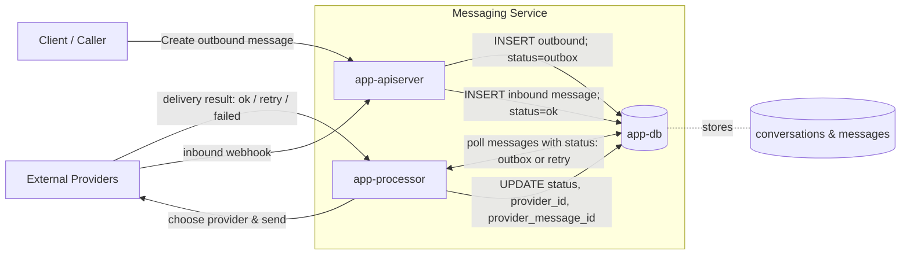
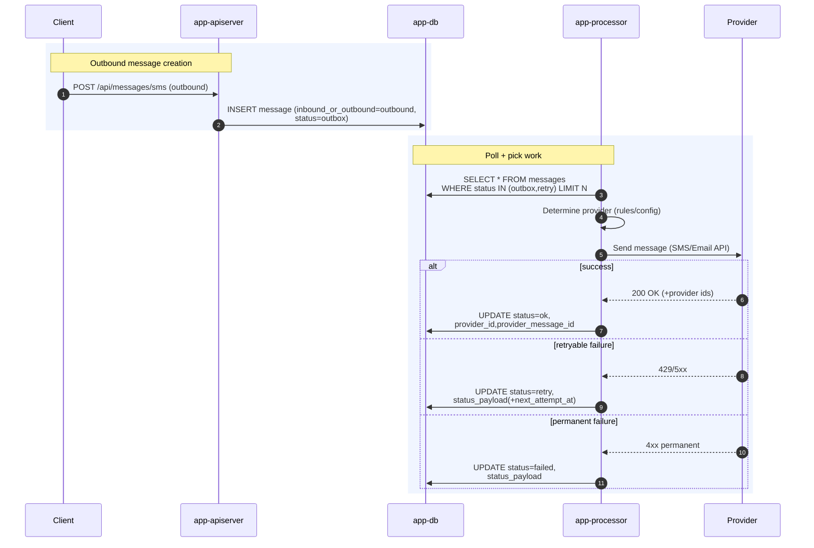
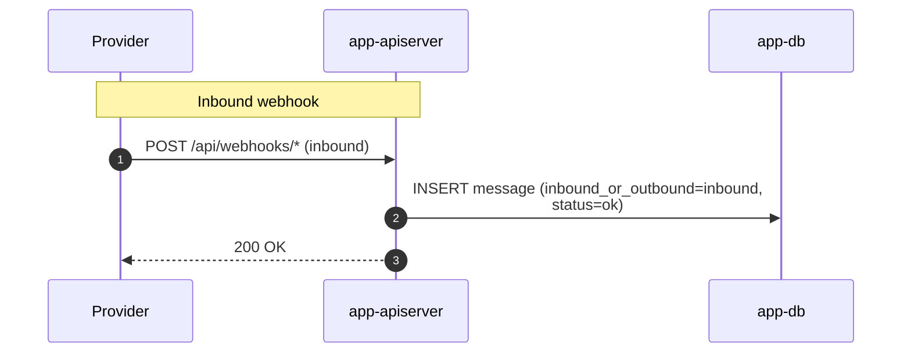

# Messaging Service

This repo is a lightweight, provider-agnostic messaging platform. It exposes a simple HTTP API for sending and receiving messages across multiple channels (e.g., SMS, MMS, and Email). The system is composed of three core services:

- **app-db** — PostgreSQL database holding `conversations` and `messages`
- **app-apiserver** — HTTP API for external clients and inbound provider webhooks
- **app-processor** — background worker that handles outbound delivery, retries, and status updates

---

## Usage

```bash
make clean
make setup
make run
make test
```

---

## System Overview

The messaging service follows a classic transactional-outbox pattern.  
Outbound messages are first stored in the database, and only later processed by a background worker.  
Inbound messages are saved immediately upon receipt.

The diagram below summarizes how all components interact.


### Description

1. **Clients** call the API to send new outbound messages.
2. The **app-apiserver** validates input and inserts a new record into the database with `status = 'outbox'`.
3. The **app-processor** polls for messages in `outbox` or `retry` status, determines which provider to use (e.g., Twilio, SendGrid), and attempts delivery.
4. The **provider** responds with success or failure; the app-processor updates the record’s `status`, `provider_id`, and related fields accordingly.
5. **Inbound messages** (e.g., replies or incoming emails) arrive as provider webhooks to the API, which saves them directly to the database.

---

## Outbound Message Lifecycle

The following sequence diagram shows the detailed steps when a client creates an outbound message.



### Description

* The **client** issues an HTTP `POST /api/messages/*` request.
* The **API server** writes a new record into the `messages` table with an initial status of `outbox`.
* The **app-processor** periodically polls for messages in `outbox` or `retry` status.
* For each message, it determines the proper **provider**, sends the message, and updates the database with the outcome.

---

## Inbound Message Flow

Inbound messages come from external providers via webhooks.
These are recorded immediately by the API server, ensuring no data loss even if the downstream processor is temporarily unavailable.



### Description

1. The **provider** (e.g., Twilio or SendGrid) calls the API’s webhook endpoint.
2. The **API server** immediately stores the inbound message in the `messages` table with `inbound_or_outbound = 'inbound'`.
3. The API returns a `200 OK` acknowledgment to the provider.

---

## Database Schema (Simplified)

| Table             | Purpose                                                                                                                                        |
| ----------------- | ---------------------------------------------------------------------------------------------------------------------------------------------- |
| **conversations** | Logical grouping of related messages between participants.                                                                                     |
| **messages**      | Each inbound or outbound message; includes metadata such as `endpoint_source`, `endpoint_target`, `status_tag`, `provider_id`, and timestamps. |

---

## Design Principles

* **Transactional Outbox Pattern** — ensures reliability and idempotence for outbound messaging.
* **Provider Agnostic** — app-processor dynamically chooses a provider per message.
* **Observability Friendly** — all state transitions (outbox → ok / retry / failed) are persisted.
* **Extendable Schema** — supports new channels or providers with minimal schema changes.

---

## Summary

The messaging service project cleanly separates responsibilities:

| Component         | Responsibility                                                |
| ------------------| ------------------------------------------------------------- |
| **app-db**        | Stores all persistent entities and message states.            |
| **app-apiserver** | Interface for clients and inbound provider events.            |
| **app-processor** | Handles outbound delivery, retries, and provider interaction. |

---
